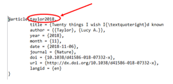

```{r setup, include=FALSE}
knitr::opts_chunk$set(echo = TRUE)
#    reference_docx: ref_style.docx
library(knitr)
library(flextable)
```

\newpage

## Introduction

### Reasons to drop word for your supplementary materials

-   It is often full of tables and figures.

-   You probably can't avoid redoing analysis.

-   Really easy to track down if you've put the right versions of figures/tables in.

-   It is cool. It makes me feel as if I'm a hacker.

### Let me guess your worries

-   Will it take too long?

-   Is it too hard to learn?

### Important things that are not covered in this documention

-   Be familiar with rmarkdown.

-   Organise analyses and results from the very beginning[@taylor2018; @veuthey2018]. Make it structured and easy to extend.

   

## Preparation

### Files

-   Reference for word style: .docx

-   Citation: .bib and .csl

-   Others: results, figures, etc.

### Main steps

-   Create a basic word doc style

-   Write the text and add citations

-   Add tables and fingures

\newpage

## Reference for word doc style

### Define output format in Yaml

An example:

``` {.R}
---
title: "Supplementary Information"
subtitle: "Coding club UoE Psychiatry"
author: "Shen X. et al."

output: 
  word_document:                   # render into a docx file
---
```

### Write an example rmarkdown file

Write a rmarkdown file with all levels of headings and text body. Render it into a docx file.

Open the docx file and edit the styles. Save the copy in a name, for example, 'ref_style.docx'.

Step 1:  

{width="325"}   

Step 2:  

{width="285"}   

Step 3:  

{width="388"}

### Update reference file in Yaml

``` {.R}
---
title: "Supplementary Information"
subtitle: "Coding club UoE Psychiatry"
author: "Shen X. et al."

output: 
  word_document:                   # render into a docx file
   reference_docx: ref_style.docx  # your reference file *
---
```

\newpage

## Add citation

[This video](https://www.youtube.com/watch?v=yk54_j3-4RM&lc=Ugy7Tdgx3VKewIzTngZ4AaABAg.9MvWztiBs3J9Mwg16gpER2) is helpful.

### Select citation style

Find and download the .csl for your chosen citation style from [here](https://github.com/citation-style-language/styles).

Update Yaml.

``` {.R}
---
title: "Supplementary Information"
subtitle: "Coding club UoE Psychiatry"
author: "Shen X. et al."

output: 
  word_document:                    # render into a docx file
   reference_docx: ref_style.docx   # your reference file
csl: nature.csl                     # citation style *
---
```

### In-text citation

#### Add citations to the bibliography file

Create a plain text file named, for example, 'bibliography.bib'.

Find doi, and put it in [the website](https://www.doi2bib.org/) to get bib text.

Copy and paste the bib text to 'bibliography.bib'.

#### Add citations to the main text

Cite using '\@keyword' in text. The keyword can be found in the bib text.

{width="272"}

\newpage

## Add tables and figures

Figures are straightforward. Often tables can't be rendered well in a word file. I often use ['flextable'.](https://ardata-fr.github.io/flextable-book/)

For example:

```{r,warning=F,echo=F}
myft <- flextable(head(mtcars), 
  col_keys = c("am", "carb", "gear", "mpg", "drat" )) %>% 
  color(., ~ drat > 3.5, ~ drat, color = "red") %>% 
  bold(., ~ drat > 3.5, ~ drat, bold = TRUE) %>% 
  theme_vanilla
myft
```

\newpage

## References

::: {#refs}
:::

##### 
